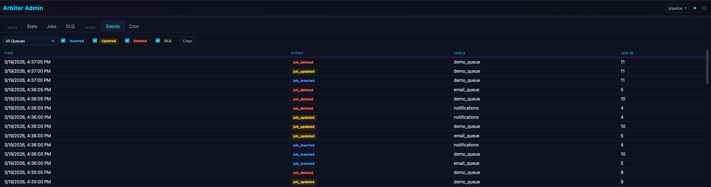
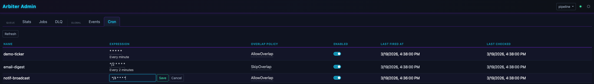
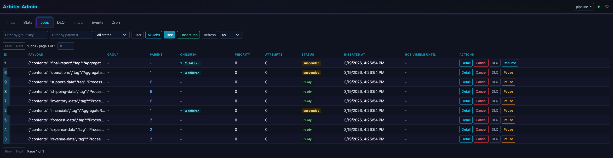

<h1 align="left">
    
    Arbiter
</h1>

An opinionated, production-ready PostgreSQL job queue for Haskell applications.

- Transactional job processing — jobs and database operations commit together
- At-least-once delivery with visibility timeouts and heartbeats
- FIFO head-of-line blocking per group key
- Concurrent worker pools with `LISTEN/NOTIFY` and polling fallback
- Job trees with fan-out/fan-in result collection
- Dead-letter queues, cron scheduling, job deduplication
- Configurable backoff, observability callbacks, structured logging
- REST API with SSE and an embedded admin UI
- File-based liveness probes for Kubernetes / systemd

**[API Documentation](https://velveteer.github.io/arbiter/)**

## Quick Start

### Dependencies

```cabal
build-depends:
  , arbiter-core
  , arbiter-worker
  , arbiter-simple       -- or arbiter-orville or arbiter-hasql
  , arbiter-migrations
```

### Payload Types

Define payload types with `ToJSON` and `FromJSON` instances.

```haskell
data EmailPayload
  = SendWelcome Text Text
  | SendReceipt Text Int
  deriving stock (Eq, Show, Generic)
  deriving anyclass (ToJSON, FromJSON)

data ImagePayload
  = ResizeImage Text Int Int
  | GenerateThumbnail Text
  deriving stock (Eq, Show, Generic)
  deriving anyclass (ToJSON, FromJSON)
```

### Type-Level Registry

Map queue table names to payload types at the type level.

```haskell
type AppRegistry =
  '[ '("email_queue", EmailPayload)
   , '("image_queue", ImagePayload)
   ]
```

The registry is enforced at compile time — each payload type maps to exactly one table, and duplicate table names are a type error.

### Migrations

```haskell
import Arbiter.Migrations qualified as Mig
import Data.Proxy (Proxy (..))
import System.Exit (die)

main :: IO ()
main = do
  result <- Mig.runMigrationsForRegistry (Proxy @AppRegistry) connStr "arbiter" Mig.defaultMigrationConfig
  case result of
    Mig.MigrationSuccess -> putStrLn "Migrations complete"
    Mig.MigrationError err -> die $ "Migration failed: " <> err
```

If the database user lacks `CREATE` privilege on the schema, create it manually first:

```sql
CREATE SCHEMA IF NOT EXISTS arbiter;
GRANT USAGE, CREATE ON SCHEMA arbiter TO your_app_user;
```

### Inserting Jobs

```haskell
import Arbiter.Core qualified as Arb
import Arbiter.Simple qualified as ArbS
import Data.Proxy (Proxy (..))

env <- ArbS.createSimpleEnv (Proxy @AppRegistry) connStr "arbiter"

ArbS.runSimpleDb env $ do
  -- Ungrouped — processed concurrently by any available worker
  _ <- Arb.insertJob (Arb.defaultJob $ SendWelcome "alice@example.com" "Alice")

  -- Grouped — jobs with the same group key are processed serially (FIFO)
  _ <- Arb.insertJob (Arb.defaultGroupedJob "user-42" $ SendReceipt "alice@example.com" 1001)
```

`insertJob` returns `Maybe (JobRead payload)` — `Nothing` when a dedup key causes the insert to be skipped.

### Processing Jobs

```haskell
import Arbiter.Core qualified as Arb
import Arbiter.Simple qualified as ArbS
import Arbiter.Worker qualified as Worker
import Control.Monad (void)
import Control.Monad.IO.Class (liftIO)
import Database.PostgreSQL.Simple qualified as PG

main :: IO ()
main = do
  env <- ArbS.createSimpleEnv (Proxy @AppRegistry) connStr "arbiter"
  config <- Worker.defaultWorkerConfig connStr 5 processEmail
  ArbS.runSimpleDb env $ Worker.runWorkerPool config

processEmail :: Arb.JobHandler (ArbS.SimpleDb AppRegistry IO) EmailPayload ()
processEmail conn job = do
  case Arb.payload job of
    SendWelcome recipient name -> do
      result <- liftIO $ sendEmail recipient ("Welcome, " <> name)
      case result of
        Left err -> Arb.throwRetryable err
        Right () -> pure ()

    SendReceipt recipient orderId -> do
      -- Transactional: this INSERT and the job ack commit together
      void $ liftIO $ PG.execute conn
        "INSERT INTO email_log (recipient, order_id) VALUES (?, ?)"
        (recipient, orderId)
```

Handlers run inside a database transaction by default. If the handler succeeds, the job is deleted and all database work commits atomically. If the handler throws, the transaction rolls back and the job is retried or moved to the DLQ.

## Architecture

The default job lifecycle:

1. **Claim** — the job becomes invisible to other workers; attempt count increments.
2. **Begin transaction.**
3. **Run handler** — the handler receives the active database connection.
4. **On success** — the job is deleted (ack) and all database work commits atomically.
5. **On failure** — the transaction rolls back; a separate transaction updates the job for retry or moves it to the DLQ.

Set `useWorkerTransaction = False` for manual transaction control — you must call `ackJob` yourself in this mode.

### Head-of-Line Blocking

- **Same group key** — processed serially. Only one visible job per group is eligible for claiming.
- **No group key** — processed concurrently by any available worker.

Group eligibility is maintained in a dedicated `{queue}_groups` table via statement-level AFTER triggers, with a periodic reaper to correct drift.

### Worker Pool Internals

1. **Dispatcher** — claims jobs via `LISTEN/NOTIFY` with polling fallback.
2. **N worker threads** — pull from a shared in-memory queue.
3. **Heartbeat** — extends visibility timeouts for in-flight jobs.
4. **Cron** — inserts scheduled jobs on tick.
5. **Reaper** — periodically corrects drift in the groups table.

## Job Features

### Deduplication

Control duplicate job insertion with dedup keys:

```haskell
-- IgnoreDuplicate: silently skip if key exists
job1 = (Arb.defaultJob payload) { Arb.dedupKey = Just (IgnoreDuplicate "order-123") }

-- ReplaceDuplicate: update existing job's payload and reset attempts
job2 = (Arb.defaultJob payload) { Arb.dedupKey = Just (ReplaceDuplicate "order-123") }
```

### Job Trees (Fan-out/Fan-in)

Children run in parallel; a finalizer collects their results when all complete.

```haskell
import Arbiter.Core.JobTree ((<~~))
import Arbiter.Core.JobTree qualified as JT

data PipelinePayload
  = ProcessChunk Text
  | Aggregate
  deriving stock (Generic)
  deriving anyclass (ToJSON, FromJSON)

myTree = Arb.defaultJob Aggregate <~~
  [ Arb.defaultJob (ProcessChunk "chunk-1")
  , Arb.defaultJob (ProcessChunk "chunk-2")
  , Arb.defaultJob (ProcessChunk "chunk-3")
  ]
Right _ <- Arb.insertJobTree myTree
```

Multi-level trees use `rollup` and `leaf`:

```haskell
myTree = JT.rollup (Arb.defaultJob Aggregate)
  [ JT.rollup (Arb.defaultJob (ProcessChunk "section-1"))
      [ JT.leaf (Arb.defaultJob (ProcessChunk "leaf-1a"))
      , JT.leaf (Arb.defaultJob (ProcessChunk "leaf-1b"))
      ]
  , JT.rollup (Arb.defaultJob (ProcessChunk "section-2"))
      [ JT.leaf (Arb.defaultJob (ProcessChunk "leaf-2a"))
      ]
  ]
```

The finalizer handler receives the monoidal merge of all child results, plus a map of DLQ'd child failures. Results are cleaned up via `ON DELETE CASCADE` when the finalizer is acked.

```haskell
handler
  :: [Text]                   -- merged child results (empty for children, populated for finalizer)
  -> Map Int64 Text           -- DLQ failures (empty for children, populated for finalizer)
  -> Arb.JobHandler (ArbS.SimpleDb AppRegistry IO) PipelinePayload [Text]
handler childResults dlqFailures conn job =
  case Arb.payload job of
    -- Children return a result. childResults/dlqFailures are empty here.
    ProcessChunk name -> pure ["processed: " <> name]
    -- Finalizer receives the monoidal merge of all child results.
    Aggregate
      | not (null dlqFailures) -> Arb.throwPermanent "Some children failed"
      | otherwise -> pure childResults

config <- Worker.defaultRollupWorkerConfig connStr 4 handler
```

Tree-scoped cancellation:

- `throwTreeCancel` — cancels the entire tree (root and all descendants).
- `throwBranchCancel` — DLQs the current child, then cascade-cancels the parent and all siblings.

### Recipe: Chunked Data Migration

Use a job tree to replace a staging table. Each child job carries its chunk of row IDs — the tree tracks completion and the finalizer runs when all chunks are processed:

```haskell
{-# LANGUAGE OverloadedLists #-}

data MigrationJob
  = MigrateChunk [Int64]
  | MigrationComplete

rowIds <- findRowsToMigrate  -- SELECT id FROM orders WHERE needs_migration
let chunks = chunksOf 1000 rowIds  -- from the split package
    tree = Arb.defaultJob MigrationComplete
      <~~ [Arb.defaultJob (MigrateChunk ids) | ids <- chunks]
Right _ <- Arb.insertJobTree tree
```

```haskell
handler childResults _dlqFailures conn job = case Arb.payload job of
  MigrateChunk ids -> do
    rowCount <- migrateRows conn ids
    pure (Sum rowCount)

  MigrationComplete -> do
    let Sum totalRows = childResults
    reportComplete totalRows
    pure childResults
```

### Cron Jobs

```haskell
import Arbiter.Worker.Cron qualified as Cron

Right healthCheck = Cron.cronJob
  "health-check"        -- unique name
  "*/5 * * * *"         -- cron expression (UTC)
  Cron.SkipOverlap      -- skip tick if previous job is still pending/running
  (\tickTime -> Arb.defaultJob (RunHealthCheck tickTime))

config <- Worker.defaultWorkerConfig connStr 4 processEmail
let configWithCron = config { Worker.cronJobs = [healthCheck] }
```

| Policy | Behavior |
|--------|----------|
| `SkipOverlap` | At most one pending/running job per cron schedule. |
| `AllowOverlap` | One job per tick. Multiple jobs from different ticks can run concurrently. |

### Error Handling

```haskell
Arb.throwRetryable "API timeout"          -- retry with backoff
Arb.throwPermanent "Invalid payload"      -- move to DLQ immediately
Arb.throwTreeCancel "Pipeline aborted"    -- cancel entire tree
Arb.throwBranchCancel "Subtask failed"    -- cancel current branch
```

Any unrecognized exception is treated as retryable. Jobs have a configurable `maxAttempts` (default: 10). After exhausting attempts, the job moves to the DLQ.

## Worker Configuration

See the [WorkerConfig haddocks](https://velveteer.github.io/arbiter/arbiter-worker/Arbiter-Worker-Config.html) for all options.

### Batched Handlers

Process multiple jobs per handler invocation:

```haskell
config <- Worker.defaultBatchedWorkerConfig connStr 10 5 batchHandler

batchHandler :: Connection -> NonEmpty (Arb.JobRead ImagePayload) -> ArbS.SimpleDb AppRegistry IO ()
batchHandler conn jobs = do
  let urls = map (getUrl . Arb.payload) (toList jobs)
  liftIO $ bulkProcess conn urls
```

All jobs in a batch succeed or fail together.

### Observability Hooks

```haskell
myHooks = Arb.defaultObservabilityHooks
  { onJobSuccess = \job claimedAt completedAt ->
      liftIO $ recordHistogram "jobs.duration" (diffUTCTime completedAt claimedAt)
  , onJobFailedAndMovedToDLQ = \err job ->
      liftIO $ sendAlert $ "Job " <> show (Arb.primaryKey job) <> " moved to DLQ: " <> err
  }

config <- Worker.defaultWorkerConfig connStr 5 handler
let instrumented = config { Worker.observabilityHooks = myHooks }
```

### Graceful Shutdown

Single-queue:

```haskell
import System.Posix.Signals qualified as Signals

config <- Worker.defaultWorkerConfig connStr 10 processEmail
Signals.installHandler Signals.sigTERM (Signals.Catch $ Worker.shutdownWorker config) Nothing
Signals.installHandler Signals.sigINT (Signals.Catch $ Worker.shutdownWorker config) Nothing
ArbS.runSimpleDb env $ Worker.runWorkerPool config
```

Multi-queue — all pools share a single shutdown signal:

```haskell
emailConfig <- Worker.defaultWorkerConfig connStr 3 processEmail
imageConfig <- Worker.defaultWorkerConfig connStr 2 processImage

ArbS.runSimpleDb env $ Worker.runWorkerPools (Proxy @AppRegistry)
  [Worker.namedWorkerPool emailConfig, Worker.namedWorkerPool imageConfig]
  $ \state -> do
    let shutdown = Signals.Catch $ Worker.signalShutdown state
    Signals.installHandler Signals.sigTERM shutdown Nothing
    Signals.installHandler Signals.sigINT shutdown Nothing
```

The dispatcher stops claiming, in-flight jobs drain within `gracefulShutdownTimeout`, and the process exits.

### Claim Throttling

Token bucket rate limiter. The `IO` action is called each dispatch cycle, so it can adapt dynamically:

```haskell
-- Static: match a known API rate limit
config { Worker.claimThrottle = Just (pure (100, 1)) }  -- 100 jobs per second

-- Adaptive: back off on 429s
rateLimitVar <- newTVarIO (100, 1)

let handler conn job = do
      result <- liftIO $ callExternalAPI (Arb.payload job)
      case result of
        RateLimited retryAfter -> do
          liftIO $ atomically $ writeTVar rateLimitVar (10, retryAfter)
          Arb.throwRetryable "Rate limited"
        OK -> do
          liftIO $ atomically $ writeTVar rateLimitVar (100, 1)
          pure ()

config { Worker.claimThrottle = Just (atomically $ readTVar rateLimitVar) }
```

### Backoff Strategies

```haskell
config { Worker.backoffStrategy = exponentialBackoff 2.0 3600 }  -- base^attempts, cap 1h
config { Worker.backoffStrategy = linearBackoff 30 600 }         -- +30s/attempt, cap 10m
config { Worker.backoffStrategy = constantBackoff 60 }           -- always 60s
config { Worker.backoffStrategy = Custom (\n -> fromIntegral n * 15) }

config { Worker.jitter = FullJitter }   -- random(0, delay)
config { Worker.jitter = EqualJitter }  -- delay/2 + random(0, delay/2) (default)
config { Worker.jitter = NoJitter }
```

### Other Options

- **Logging** — structured JSON to stderr, fast-logger, or a custom callback
- **Liveness probes** — file-based health check; Kubernetes example:
  ```yaml
  livenessProbe:
    exec:
      command: ["sh", "-c", "find $TMPDIR/arbiter-worker-* -mmin -5"]
    initialDelaySeconds: 30
    periodSeconds: 60
  ```
- **Pool sizing** — `poolConfigForWorkers` auto-sizes based on worker count
- **Pause/resume** — at worker, job, or tree level

## REST API and Admin UI

The `arbiter-servant` and `arbiter-servant-ui` packages provide a REST API and
admin dashboard. They can be used as standalone WAI applications or integrated
into your own Servant API.

```haskell
import Arbiter.Servant qualified as Servant

config <- Servant.initArbiterServer (Proxy @AppRegistry) connStr "arbiter"
Servant.runArbiterAPI 8080 config
```

Embed as a sub-route in an existing Servant application:

```haskell
import Arbiter.Servant qualified as Arb
import Arbiter.Servant.UI qualified as ArbUI

type MyAPI =
  "api" :> MyBusinessRoutes
    :<|> "arbiter" :> (Arb.ArbiterAPI AppRegistry :<|> ArbUI.AdminUI)
```

See the [arbiter-servant-ui haddocks](https://velveteer.github.io/arbiter/arbiter-servant-ui/Arbiter-Servant-UI.html)

<details>
<summary>Screenshots</summary>

[](docs/admin-jobs.png)
[](docs/admin-events.png)
[](docs/admin-cron.png)

</details>

### Endpoints

Per-queue endpoints under `/api/v1/:table/`:

| Method | Path | Description |
|--------|------|-------------|
| `GET` | `jobs` | List jobs (params: `limit`, `offset`, `group_key`, `parent_id`) |
| `POST` | `jobs` | Insert a job |
| `POST` | `jobs/batch` | Insert multiple jobs |
| `GET` | `jobs/:id` | Get job by ID |
| `DELETE` | `jobs/:id` | Cancel job (cascade-deletes children) |
| `POST` | `jobs/:id/promote` | Make a delayed job immediately visible |
| `POST` | `jobs/:id/move-to-dlq` | Move job to dead-letter queue |
| `POST` | `jobs/:id/suspend` | Suspend job |
| `POST` | `jobs/:id/resume` | Resume suspended job |
| `GET` | `jobs/in-flight` | List currently claimed jobs |
| `GET` | `dlq` | List DLQ entries |
| `POST` | `dlq/:id/retry` | Retry from DLQ |
| `DELETE` | `dlq/:id` | Delete from DLQ |
| `GET` | `stats` | Queue statistics |

Global endpoints under `/api/v1/`:

| Method | Path | Description |
|--------|------|-------------|
| `GET` | `queues` | List all registered queues |
| `GET` | `events/stream` | SSE stream for real-time notifications |
| `GET` | `cron/schedules` | List cron schedules |
| `PATCH` | `cron/schedules/:name` | Override cron expression at runtime |

## Backend Integration

Arbiter's core is backend-agnostic via the `MonadArbiter` typeclass. Three official adapters are provided.

If you're choosing a backend based on raw throughput:

**Operational overhead** (no-op handler, 200k pre-loaded queue, 4 pools × 10 workers, PostgreSQL 17, Apple M1 Pro):

| Backend | Single job | Batched (10) | Single (50k groups) | Batched (50k groups) |
|---------|-----------|-------------|---------------------|---------------------|
| hasql | 3,055/s | 12,111/s | 2,773/s | 11,979/s |
| orville | 2,602/s | 9,745/s | 2,364/s | 10,083/s |
| postgresql-simple | 1,890/s | 9,737/s | 1,652/s | 8,219/s |

Batched mode processes multiple jobs per transaction. The hasql backend uses prepared statements for plan caching. Grouped workloads add overhead from triggers that maintain the groups table for head-of-line blocking — with 50k active groups, single-job throughput drops ~10% while batched mode is largely unaffected. Under high insert concurrency, prepared statement overhead narrows the gap between hasql and orville.

### arbiter-simple (postgresql-simple)

Built on `postgresql-simple` with `resource-pool`. Handlers receive a raw `Connection`. Nested transactions use savepoints automatically.

```haskell
env <- ArbS.createSimpleEnv (Proxy @AppRegistry) connStr "arbiter"
ArbS.runSimpleDb env $ Arb.insertJob (Arb.defaultJob $ SendWelcome "alice@example.com" "Alice")
```

Share a transaction with external database work:

```haskell
PG.withTransaction conn $ do
  PG.execute conn "INSERT INTO orders (id) VALUES (?)" (PG.Only orderId)
  ArbS.inTransaction @AppRegistry conn "arbiter" $
    Arb.insertJob (Arb.defaultJob (ProcessOrder orderId))
```

See the [arbiter-simple haddocks](https://velveteer.github.io/arbiter/arbiter-simple/Arbiter-Simple.html)

### arbiter-orville (orville-postgresql)

Integrates with `orville-postgresql`. Handlers do not receive a connection parameter — Orville manages connections and transactions internally. Requires a custom monad with `MonadOrville` and `HasArbiterSchema` instances.

See the [arbiter-orville haddocks](https://velveteer.github.io/arbiter/arbiter-orville/Arbiter-Orville.html)

### arbiter-hasql (hasql)

Built on `hasql` with `resource-pool`. Handlers receive a `Hasql.Connection` for typed hasql queries inside the worker transaction.

```haskell
env <- ArbH.createHasqlEnv (Proxy @AppRegistry) connStr "arbiter"
ArbH.runHasqlDb env $ Arb.insertJob (Arb.defaultJob $ SendWelcome "alice@example.com" "Alice")
```

Share a transaction with external hasql work:

```haskell
-- Session.script (hasql >= 1.10) or Session.sql (hasql < 1.10)
_ <- Hasql.use conn (Session.script "BEGIN")
ArbH.inTransaction @AppRegistry conn "arbiter" $
  Arb.insertJob (Arb.defaultJob (ProcessOrder orderId))
_ <- Hasql.use conn (Session.script "COMMIT")
```

See the [arbiter-hasql haddocks](https://velveteer.github.io/arbiter/arbiter-hasql/Arbiter-Hasql.html)
